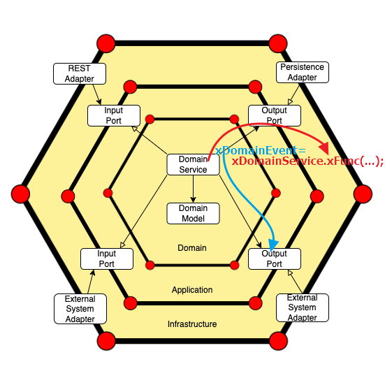

# Terminology
### Entity
- An Entity is an object that is defined not by its attributes, but by a thread of continuity and its **identity(ID)**. 
- It's something in the domain that **has continuity over time and across different states but is uniquely identifiable**. 
- Example of Entities
    - Employee
    - Customer
    - Payment


### Value Object
- A Value Object is an object that describes some characteristic or attribute of a thing but carries **no concept of identity (it is immutable)**. 
- It is defined only by its properties. **If you change any attribute of a Value Object, it becomes a new Value Object**.
- Example of Value Objects
    - Color
    - Money
    - Temparture
    - Position
    - Nationality


### Aggregate
- **An Aggregate is a cluster of domain objects (Entities and Value Objects) that can be treated as a single unit**. 
- An Aggregate defines a consistency boundary around its components, meaning that it enforces invariants for all changes to the objects within that boundary for the life of the transaction.

### Aggregate Root
- The Aggregate Root is the Entity within an Aggregate that external objects are allowed to hold references to. 
- **It's the entry point to the Aggregate**, ensuring that the Aggregate's invariants are maintained. 
- **Other Entities within the Aggregate should only be accessed through the Aggregate Root to maintain consistency** and ensure the Aggregate's rules aren't violated.
- These concepts form the building blocks of the Tactical Design in DDD, helping structure complex domain logic into manageable, modular components.
- - Example of Aggregate Root
```java
public abstract class AggregateRoot<ID> extends BaseEntity<ID> {
}

//AggregateRoot (also an Entity)
public class Order extends AggregateRoot<OrderId> { 

  public static final String FAILURE_MESSAGE_DELIMITER = ",";
  
  //Entity
  private final List<OrderItem> items;

  //ValueObject/////
  private final CustomerId customerId;
  private final RestaurantId restaurantId;
  private final StreetAddress deliveryAddress;
  private final Money price;
  private TrackingId trackingId;
  private OrderStatus status;
  //////////////////

  private List<String> failureMessages;

  //Domain Business Logic/////////////////////////////////////////
  public void initializeOrder(){
    setId(new OrderId(UUID.randomUUID()));
    trackingId = new TrackingId(UUID.randomUUID());
    status = OrderStatus.PENDING;
    initializeOrderItems();
  }

  private void initializeOrderItems() {
    long itemId = 1;
    for (OrderItem item : items) {
      item.initializeOrderItem(super.getId(), new OrderItemId(itemId++));
    }
  }

  public void pay(){
    if(!Objects.equals(status, OrderStatus.PENDING))
      throw new OrderDomainException("Order status is not pending !");
    status = OrderStatus.PAID;

  }
  //......
  //Domain Business Logic/////////////////////////////////////////
}
```

### Domain Event
- A Domain Event is something that has happened in the domain that you want other parts of the same domain (or even external systems) to be aware of. 
- **It's a way of communicating changes in the state of the domain to other parts of the application or other applications.**

### Domain Service
- Domain Services are stateless operations that **perform calculations or logic that doesn't naturally fit within an Entity or Value Object**. 
- **They encapsulate business logic that might involve more than one domain object**.

### Application Services
- Application Services act as **the interface between the domain layer and the outside world (UI, tests, other systems)**. 
- They orchestrate the execution of domain operations and delegate domain logic to the other elements of the domain layer (Entities, Value Objects, Domain Services). 
- **They don't contain business logic themselves but control the flow of data and commands within the application**.

### Port & Adaptor
```
//Primary adapter
infra.adapter.controller 
  |
 Dto (Data Transfer Object)
  |
  V
//Primary port
application-service.ports.input.service
application-service.serviceImpl
  |
 Aggregate = Entities + ValueObjects
  |
  V                                          //Secondary port                            //Secondary adpater(RabbitMQ/Kafka)
domain.domain-service ---DomainEvent---> application-service.ports.output.msgPublisher | infra.adapter.msgPublisherImpl ------> send data to another microservice
  |
 Aggregate =Entities + ValueObjects
  |
  V
//Secondary port
application-service.ports.output.repository
application-service.ports.output.repositoryImpl
  |
 Po (Persistent Object)
  |
  V
//Secondary adapter
infra.adapter.JpaRepository 
```


### Port
##### Primary (or Driving) Ports: 
- These are the interfaces that the application provides for the outside world to use. 
- They define how the outside world, such as a user interface or an automated script, can interact with the application.
##### Secondary (or Driven) Ports: 
- These ports define how the application interacts with external systems or tools. 
- Instead of dictating how external systems should communicate with the application, these ports specify what the application needs from the - outside world. For example, an interface that defines how to access data from a database is a secondary port.

### Adapter
##### Primary Adapter: 
- This adapter takes external inputs (e.g., from a UI or external request) and translates them into calls to the application's primary ports. 
- It adapts the outside world to the application.
##### Secondary Adapter: 
- This adapter implements a secondary port to interact with an external system, such as a database or a third-party service. 
- It adapts the application to the outside world. 
- This approach aligns well with the principles of DDD by emphasizing the importance of the domain model and isolating it from external influences.

<hr>

# References:
- https://ithelp.ithome.com.tw/users/20111997/ironman/2730
- https://www.youtube.com/watch?v=JubdZIdLQ4M&list=PLsrRMpHuSOU1_AaGbbuJSxhYZmhsWYirn&index=1&ab_channel=DrawingBoxes
- https://www.youtube.com/watch?v=xFl-QQZJFTA&list=PLsrRMpHuSOU1_AaGbbuJSxhYZmhsWYirn&index=4&ab_channel=DrawingBoxes
- https://www.udemy.com/course/microservices-clean-architecture-ddd-saga-outbox-kafka-kubernetes/?couponCode=KEEPLEARNING